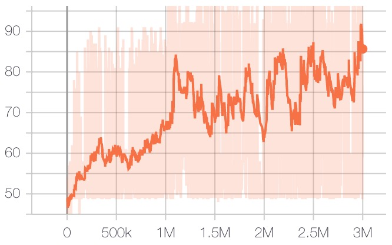
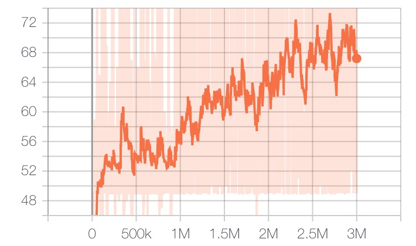

# hack-flappy-bird-drl 
Training a DRL agent to play Flappy Bird. Includes implementations of DQN, A2C, and PPO methods. 

| DQN  | A2C | PPO |
|:------------: |:---------------: |:---------------:|
| | [WIP] | [WIP] |


## ⚙️ Running the code

```sh
# General format of commands
python main.py --algo=<dqn, a2c, ppo> --mode=<train, eval>

# So, for example, to train a2c:
python main.py --algo=a2c --mode=train

# To play a game using dqn:
python main.py --algo=dqn --mode=eval --weights_dir=exp1/2000000.pt

# You canalso  visualize your results via TensorBoard
tensorboard --logdir <exp_name>
```

For more options, run

```sh
python main.py -h

usage: main.py [-h] [--algo {dqn,a2c,ppo}] [--mode {train,evaluation}]
               [--exp_name EXP_NAME] [--weights_dir WEIGHTS_DIR]
               [--n_train_iterations N_TRAIN_ITERATIONS]
               [--learning_rate LEARNING_RATE]
               [--len_agent_history LEN_AGENT_HISTORY]
               [--discount_factor DISCOUNT_FACTOR] [--batch_size BATCH_SIZE]
               [--initial_exploration INITIAL_EXPLORATION]
               [--final_exploration FINAL_EXPLORATION]
               [--final_exploration_frame FINAL_EXPLORATION_FRAME]
               [--replay_memory_size REPLAY_MEMORY_SIZE]
               [--n_workers N_WORKERS]
               [--buffer_update_freq BUFFER_UPDATE_FREQ]
               [--entropy_coeff ENTROPY_COEFF]
               [--value_loss_coeff VALUE_LOSS_COEFF]
               [--max_grad_norm MAX_GRAD_NORM] [--grad_clip GRAD_CLIP]
               [--log_frequency LOG_FREQUENCY]
               [--save_frequency SAVE_FREQUENCY] [--n_actions N_ACTIONS]
               [--frame_size FRAME_SIZE]

drl-experiment options

optional arguments:
  -h, --help            show this help message and exit
  --algo {dqn,a2c,ppo}  run the network in train or evaluation mode
  --mode {train,evaluation}
                        run the network in train or evaluation mode
  --exp_name EXP_NAME   name of experiment, to be used as save_dir
  --weights_dir WEIGHTS_DIR
                        name of model to load
  --n_train_iterations N_TRAIN_ITERATIONS
                        number of iterations to train network
  --learning_rate LEARNING_RATE
                        learning rate
  --len_agent_history LEN_AGENT_HISTORY
                        number of stacked frames to send as input to networks
  --discount_factor DISCOUNT_FACTOR
                        discount factor used for discounting return
  --batch_size BATCH_SIZE
                        batch size
  --initial_exploration INITIAL_EXPLORATION
                        epsilon greedy action selection parameter
  --final_exploration FINAL_EXPLORATION
                        epsilon greedy action selection parameter
  --final_exploration_frame FINAL_EXPLORATION_FRAME
                        epsilon greedy action selection parameter
  --replay_memory_size REPLAY_MEMORY_SIZE
                        maximum number of transitions in replay memory
  --n_workers N_WORKERS
                        number of actor critic workers
  --buffer_update_freq BUFFER_UPDATE_FREQ
                        refresh buffer after every x actions
  --entropy_coeff ENTROPY_COEFF
                        entropy regularization weight
  --value_loss_coeff VALUE_LOSS_COEFF
                        value loss regularization weight
  --max_grad_norm MAX_GRAD_NORM
                        norm bound for clipping gradients
  --grad_clip GRAD_CLIP
                        magnitude bound for clipping gradients
  --log_frequency LOG_FREQUENCY
                        number of batches between each tensorboard log
  --save_frequency SAVE_FREQUENCY
                        number of batches between each model save
  --n_actions N_ACTIONS
                        number of game output actions
  --frame_size FRAME_SIZE
                        size of game frame in pixels
```

## 📌 Deep Q-Networks (DQN)

An agent in state *s ∈ S* takes an action *a ∈ A* which moves it into another state *s'*. The environment gives a reward *r ∈ R* as feedback; the mechanism for which an agent chooses an action in a state *s* is known as its policy *π(a|s)*. At a given time step *t*, the agent aims to take an action s.t. it maximizes its future reward *R<sub>t</sub> = r<sub>t</sub> + γr<sub>t+1</sub> + γ<sup>2</sup>r<sub>t+2</sub> + ... + + γ<sup>n-t</sup>r<sub>n</sub> = r<sub>t</sub> + γR<sub>t+1</sub>*. Here, *γ* is a discount factor which adjusts for the fact that future predictions tend to be less reliable. 

The Q-value is a function which represents the maximum future reward when the agent performs an action *a* in state *s*, *Q(s<sub>t</sub>,a<sub>t</sub>)= max R<sub>t+1</sub>*. The estimation of future reward is given by the Bellman equation *Q(s,a) = r + γ max<sub>a'</sub> Q(s',a')*.

For large state-action spaces, learning this giant table of Q-values can quickly become computationally infeasible. In deep Q-learning, we use neural networks to approximate q-values *Q(s,a; θ)* (where *θ* are the network parameters). There are some added tricks to stabilize learning:
- **Experience replay**: We store episode steps (*s, a, r, s'*) aka "experiences" into a replay memory. Minibatches of these experiences are later sampled during training. Not only does experience replay improve data efficiency, it also breaks up strong correlations which would occur if we used consecutive samples, reducing the variance of each update.
- **Epsilon-greedy exploration**: With a probability *ε* we take a random action, otherwise take the optimal predicted action. *ε* is decayed over the number of training episodes. This strategy helps tackle the exporation vs. exploitation dilemma.

During training, we optimize over the MSE loss of the temporal difference error *(Q(s,a;θ) - (r(s,a) + γ max<sub>a</sub> Q(s',a;θ)))<sup>2</sup>*

In flappy bird, our action space is either "flap" or "do nothing", our state space is a stack of four consecutive frames, and our reward is driven by keeping alive (+0.1) or passing through a pipe pair (+1).

### Results

I had to stop/resume training a couple times, which is why the training curve isn't completely smooth. This could probably be fixed if you saved off your optimizer in addition to your network weights! As you can see, the length (in frames) of a playing episode increases as flappy learns good strategies.


## 📌 Advantage Actor Critic (A2C)

The A's of A2C:

- **Advantage**: We learned about Q-values in the previous section. The state-value *V(s)* can be thought of the measure of the "goodness" of a certain state and can be recovered from the Q-values and the policy: *V(s) = ∑<sub>a∈A</sub> Q(s,a)π(a|s)*. The difference between the Q-value and V is known as the advantage, which captures how much better and action is compared to others at a given state. Because our network is not computing Q values directly, we can approximate Q with the discounted reward R. A = *Q(s,a) - V(s) ~ R - V(s)*.
- **Actor-Critic**: We have two types of learners, the actor and the critic, which manifest as two separate fully-connected layers on top of a base network. The actor learns the policy *π(a|s;θ)*, outputting the best action probabilities given its current state. The critic learns the state-value function *V(s;w)*-- it can therefore evaluate the actor's suggested action and guide the actor's training updates. 

During training, we try to minimize a loss which consists of a value loss, a policy loss, and an entropy loss. The value loss is *∑A(s)<sup>2</sup>* and the policy loss is  *∑A(s)log(V(s))*. The entropy loss *H(π)* helps encourage a good distribution of action probabilities. 

### Results
I found hyperparameter tuning for A2C to be particularly difficult -- the network also seemed pretty sensitive to initialization scheme. Given my limited resources, this is the final result I got for A2C:


## 📌 Proximal Policy Optimization (PPO) 

Policy gradient methods are sensitive to step size and often have very poor sample efficiency, taking many timesteps to learn simple tasks. We can eliminate this sensitivity by optimizing the size of a policy update. The central idea of Proximal Policy Optimization (PPO) is to constrain the size of a policy update. To do that, we use a ratio which tells us the difference between our new and old policy, clipping this value to ensure that our policy update will not be too large. 

In PPO, we want to optimize the following loss function: *(π(a|s)/π'(a|s)) A(s)*. The policy ratio is clipped to be between *(1-ε, 1+ε)*

### Results
As with A2C, I think PPO would have benefitted from better hyperparameter tuning, but overall we do see improvement as we increase the number of training iterations:


## 📖 References
- DQN: 
    - Paper: https://deepmind.com/research/publications/human-level-control-through-deep-reinforcement-learning
    - PyTorch tutorial: https://pytorch.org/tutorials/intermediate/reinforcement_q_learning.html
    - Toptal blog post: https://www.toptal.com/deep-learning/pytorch-reinforcement-learning-tutorial

- A2C: 
    - Paper: https://arxiv.org/pdf/1602.01783v1.pdf
    - MorvanZhou's implementation: https://github.com/MorvanZhou/pytorch-A3C
    - Arthur Juliani's blog post: https://medium.com/emergent-future/simple-reinforcement-learning-with-tensorflow-part-8-asynchronous-actor-critic-agents-a3c-c88f72a5e9f2
    
- PPO
    - Paper: https://arxiv.org/abs/1707.06347
    - OpenAI blog post: https://openai.com/blog/openai-baselines-ppo/
    - Nikhil's implementation: https://github.com/nikhilbarhate99/PPO-PyTorch
